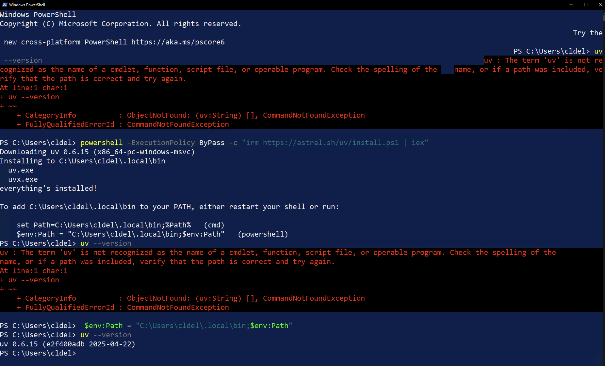
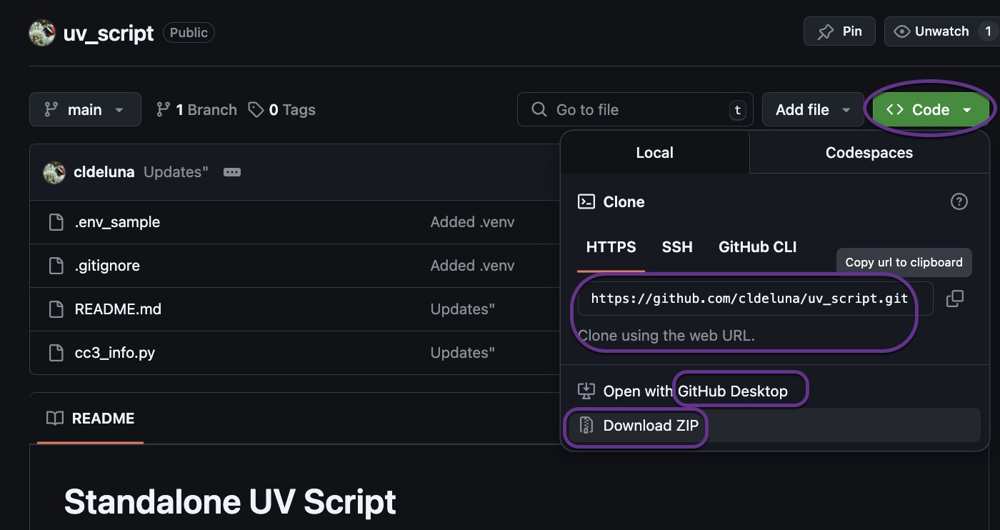

# Standalone UV Script

Companion Repository for Ultra Valuable uv for Dynamic, On-Demand Python Virtual Environments

Test script which requires three 3rd party Python modules.  It provides information about a country using the countrys three letter country code.  By default it will provide information about CZE, the Czech Republic.


## What is UV?

[Astral's](https://astral.sh/) **uv** is a fast, all-in-one Python package and project manager written in Rust that unifies and accelerates Python development workflows by replacing multiple tools—including pip, pip-tools, poetry, pipx, pyenv, virtualenv, and twine—with a single, high-performance utility. It handles package installation, dependency resolution, virtual environments, project and Python version management, script execution, and package publishing, all with a familiar CLI and dramatic speed improvements. By consolidating these capabilities, uv simplifies and streamlines Python development for everything from individual scripts to complex multi-workspace projects.

## Why are we using it?

This repository was inspired by [NAF's](https://networkautomation.forum/) [AutoCon3](https://networkautomation.forum/autocon3) [Templating workshop](https://networkautomation.forum/autocon3#workshop).

Because **uv** is a comprehensive package manager it will be easier to create the necessary **Python execution environments** for the scripts we will be executing in our Jinja2 workshop.

## Install UV

### Mac and Linux

```bash
curl -LsSf https://astral.sh/uv/install.sh | sh

# Add to the current PowerShell session’s PATH (or open a new terminal window):
source $HOME/.local/bin/env

# Verify it worked (See screen shot below for expected output)
uv --version
```


### Windows (PowerShell)

Install uv using PowerShell

``` powershell
powershell -ExecutionPolicy ByPass -c "irm https://astral.sh/uv/install.ps1 | iex"
```


When you install `uv` on **Windows using PowerShell**, the installer typically adds the `uv` binary to your user’s `AppData\Local\uv\bin` directory and updates the `Path` environment variable to add that directory.  However, **this change won't take effect in the same terminal session unless you manually update the `PATH` variable**.

```powershell
# Update the PATH in your current PowerShell session so you can use uv right away.
# Make sure you include the quotes
"$env:USERPROFILE\AppData\Local\uv\bin"

# Temporarily add to the current PowerShell session’s PATH:
$env:Path += ";$env:USERPROFILE\AppData\Local\uv\bin"

# Verify it worked
uv --version

```

If you have any problems, open up a new PowerShell window and try to execute the `uv --version` command.

If that does not work, please review the uv installation instructions:

##### [Official UV Installation Guide](https://docs.astral.sh/uv/getting-started/installation/)

Tip: Make It Permanent (System/User Environment Variable)

If you want `uv` to always be available from any new terminal:

```
[Environment]::SetEnvironmentVariable("Path", $env:Path + ";$env:USERPROFILE\AppData\Local\uv\bin", "User")
```

Then open up a new terminal.

---

## What to do with this Repository?

**Download or Clone** the repository and move into the repository directory (unzip if you used the download option).



This repository is intended to: 

1. provide brief instructions on installing **uv**
2. provide a small Python script to test the installation

No virtual environment needs to be built or activated.

Executing the test script should

1. Install the required version of Python (Python 3.11 or greater)
2. Create a virtual environment on demand when the script is run and install the required modules (upcountry, requests, python-dotenv)
3. Sucessfully execute the script

Example of the inline script metadata:

```python
# /// script
# requires-python = ">=3.11"
# dependencies = [
#     "pycountry>=24.2.0",
#     "requests>=2.31.0",
#     "python-dotenv>=1.0.0",
# ]
# ///
```


## Execute Test Script

This scripts uses the Restful Countries API which requires a (free) token.

1. Rename the `.env_sample` file  to `.env` taking care not to add a file extension.  (`.env` is the file extension!)
2. Replace "Your API Token from https://restfulcountries.com/" with your actual API token.

```python
# Rename this file from .env_sample to .env taking care not to add a file extension.  .env is the file extension!
# Replace Your API Token from https://restfulcountries.com/ with your actual API token

CC3_API_TOKEN = "Your API Token from https://restfulcountries.com/"
```

Alternatively you can use the -k option.

```bash
% uv run cc3_info.py -k "Your API Token from https://restfulcountries.com/"
```

Script options:

```bash
% uv run cc3_info.py -h
usage: cc3_info.py [-h] [-s] [-a] [-k API_KEY]

Fetch information about a country using its 3-letter code

options:
  -h, --help            show this help message and exit
  -s, --select          Show country selection interface
  -a, --use-api         Use REST API instead of pycountry module for country codes
  -k API_KEY, --api-key API_KEY
                        API key for Restful Countries API

Usage: ' uv run cc3_info.py or python cc3_info.py'
```


```bash
uv run cc3_info.py
```

Expected output without API Token:

```python
% uv run cc3_info.py

----- Dynamic On-demand Virtual Environment Details -----
        Python version: 3.11.12
        Virtual environment path: /Users/claudiadeluna/.cache/uv/environments-v2/cc3-info-1b81c18f915397c7

        idna==3.10
        requests==2.32.3
        python-dotenv==1.1.0
        charset-normalizer==3.4.1
        certifi==2025.1.31
        urllib3==2.4.0
        pycountry==24.6.1
Environment variables loaded from .env file
Error: API token required. Please provide it via --api-key argument or set CC3_API_TOKEN environment variable.

```

While the script was not able to retrieve any country data, the above does show that the script was executed without errors and with the required virtual environment.

Expected output with API Token:

```bash
% uv run cc3_info.py                                                   

----- Dynamic On-demand Virtual Environment Details -----
        Python version: 3.11.12
        Virtual environment path: /Users/claudiadeluna/.cache/uv/environments-v2/cc3-info-1b81c18f915397c7

        idna==3.10
        requests==2.32.3
        python-dotenv==1.1.0
        charset-normalizer==3.4.1
        certifi==2025.1.31
        urllib3==2.4.0
        pycountry==24.6.1
Environment variables loaded from .env file
Found environment variable: CC3_API_TOKEN
Fetching available country codes...
Using default country: Czech Republic (CZE)

Fetching information for CZE...
Requesting: https://restfulcountries.com/api/v1/countries?iso3=CZE
NAME: Czech Republic
FULL_NAME: Czechia
CAPITAL: Prague
ISO2: CZ
ISO3: CZE
COVID19: {'total_case': '0', 'total_deaths': '0', 'last_updated': '2020-12-01T08:19:56.000000Z'}
CURRENT_PRESIDENT: None
CURRENCY: CZK
PHONE_CODE: 420
CONTINENT: Europe
DESCRIPTION: None
SIZE: 78,866 km²
INDEPENDENCE_DATE: None
POPULATION: 10,717,290
HREF: {'self': 'https://restfulcountries.com/api/v1/countries/Czech%20Republic', 'states': 'https://restfulcountries.com/api/v1/countries/Czech%20Republic/states', 'presidents': 'https://restfulcountries.com/api/v1/countries/Czech%20Republic/presidents', 'flag': 'https://restfulcountries.com/assets/images/flags/Czech-Republic.png'}
```


#### Inline Script Metadata

https://docs.astral.sh/uv/guides/scripts/#running-a-script-with-dependencies


### Handy Commands

| Command                                    | Description                                                  |
| ------------------------------------------ | ------------------------------------------------------------ |
| `uv --version`                             | Good test to confirm **uv** is installed as well as checking the version |
| `uv python list`                           | Will display the versions of Python available/installed under **uv** management |
| `uv python install 3.10`                   | Install the latest version of Python 3.10 under uv. This is functionaly often implemented with `pyenv`. |
| `uv add --script example.py --python 3.12` | UV will add inline script metadata including the required version of Python <br />to a TOML "header" in the example.py script.  This gives the script all it <br />needs to be executed (run) under **uv** and create the required <br />virtual environment without any further action from the user. |
| `uv run myscript.py`                       | This is the equivalent of of 'python myscript.py' but running it <br />under **uv** manages the virtual environment creation. |
| `uv sync --script my script.py`            | Updates the virtual environment                              |
|                                            |                                                              |


```bash
curl -LsSf https://astral.sh/uv/install.sh | sh
source $HOME/.local/bin/env
uv --version

```
```
cd <unzipped or cloned directory for this repository>
ls -al
uv --version
uv run cc3_info.py

```

```bash
uv add --script cc3_info.py --python 3.11 requests pycountry python-dotenv

% uv sync --script cc3_info.py 
Using script environment at: /Users/claudiadeluna/.cache/uv/environments-v2/cc3-info-1b81c18f915397c7
Resolved 7 packages in 157ms
Audited 7 packages in 0.04ms


```